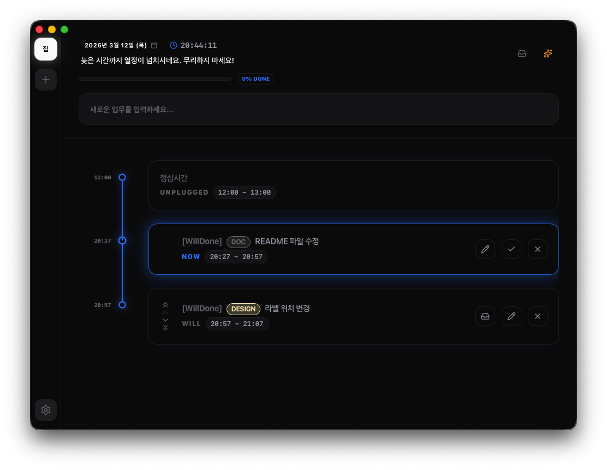
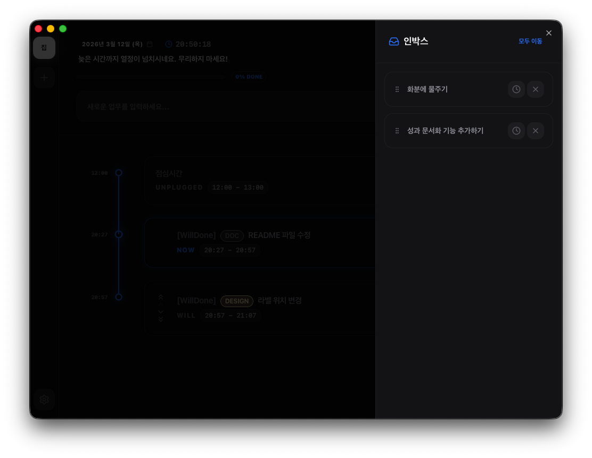

# will-done

전 직장에서 구조조정으로 퇴사하던 날, Google Workspace에 쌓아뒀던 수백 개의 TODO를 꺼내보려고 했습니다.

하지만 모든 스페이스에 등록했던 TODO를 한 번에 뽑아볼 방법이 당시에는 없었습니다.
내가 회사에서 무슨 일을 했는지, 어떤 문제를 풀었는지 증명할 수단이 없었습니다.
열심히 일했다는 사실이 그 어디에도 남아 있지 않았습니다.

`will-done`은 바로 그 경험에서 시작했습니다. 단순히 할 일을 관리하는 앱이 아닙니다. **내가 한 일을 기록하고, 그 기록을 온전한 내 경력으로 만들어주는 도구입니다.**

---

## 어떤 기능이 있나요?



태스크를 등록할 때 제목과 함께 **계획 및 목표 메모**를 남깁니다. 어떤 프로젝트인지, 어떤 성격의 작업인지는 라벨로 분류할 수 있습니다.

등록하는 순간, 첫 번째 태스크는 바로 `NOW` 상태가 됩니다.
이후에 등록하는 태스크들은 `WILL` 상태로 타임라인 아래에 차곡차곡 쌓이게 되죠.
지금 하고 있는 일이 끝나면, 다음 대기 중이던 태스크가 자동으로 `NOW`로 올라옵니다.

태스크를 끝내면 실제 소요 시간과 짧은 성과 메모를 남깁니다.
그게 전부입니다. 그렇게 매일 쌓인 기록들이 나중에는 든든한 경력이 됩니다.

---

## Unplugged Time

점심시간이나 저녁시간처럼 업무를 하지 않는 시간대를 워크스페이스 설정에 등록해 두면, 태스크 스케줄링 시 해당 시간을 자동으로 피해 갑니다.

예를 들어 19:00 ~ 20:00가 저녁시간으로 등록된 상태에서
18:40에 30분짜리 태스크를 추가하면 다음과 같이 나뉩니다.

```text
18:40 ~ 19:00  ─┐
[19:00 ~ 20:00] ├─ 하나의 태스크로 연결
20:00 ~ 20:10  ─┘
```

두 블록은 화면상 분리되어 보이지만, 앱 내부에서는 하나의 태스크로 안전하게 묶여 있습니다.

## Inbox



업무에 집중하다 보면 갑자기 처리해야 할 다른 일이나 번뜩이는 아이디어가 떠오를 때가 있습니다. 당장 할 일은 아니지만 잊어버리기 전에 어딘가에 적어두어야 할 때, 인박스(Inbox)에 가볍게 던져두세요. 머릿속의 짐을 내려놓고 지금 하던 일(NOW)에 계속 몰입할 수 있습니다.

또한, 오늘 더 이상 진행하기 어려워진 `WILL` 태스크가 있다면 무리하지 마세요. 인박스에 안전하게 보관해 두었다가, 다음 날 아침에 다시 꺼내어 새로운 타임라인을 계획할 수 있습니다.

---

## AI 성과

하루가 끝날 때 성과 버튼을 누르면, `DONE` 상태로 쌓인 태스크들의 계획 메모와 완료 메모를 모아 AI가 일별 성과 문서를 정성껏 작성해 줍니다. 이직을 준비할 때, 연봉을 협상할 때, 혹은 경력기술서를 쓸 때. "내가 거기서 뭘 했더라" 하고 기억을 더듬으며 고생하지 않도록 돕고 싶었습니다.

**모든 데이터는 외부 서버를 거치지 않고 오직 내 PC의 로컬 SQLite에만 안전하게 저장됩니다.**

---

## 앞으로 추가할 것

지금은 성과 중심의 기능이 주를 이루고 있지만, 궁극적인 목표는 하나입니다.

> 내가 이 회사에서 무엇을 했는지, 다음 면접장에서 자신 있게 꺼낼 수 있는 문서를 자동으로 만들어주는 것.

* [ ] 업무 히스토리를 경력기술서 형태로 정리하는 기능
* [ ] 기간별 / 프로젝트별 필터링 및 내보내기 기능

---

## 태스크 흐름

```text
Inbox → NOW / WILL → DONE → Achievement
            ↑
      Unplugged Time 자동 회피

```

| 상태 | 설명 |
| --- | --- |
| `NOW` | 현재 진행 중. 마감 시간 초과 시 경고를 표시합니다. |
| `WILL` | 대기 중인 예정 태스크. 순서대로 NOW로 전환됩니다. |
| `DONE` | 완료. 실제 소요 시간과 성과 메모가 기록되어 있습니다. |
| `Inbox` | 오늘 진행하지 못한 WILL 태스크를 임시로 보관합니다. |

---

## 기술 스택

| 영역 | 스택 |
| --- | --- |
| Frontend | React 18, TypeScript, Vite, Tailwind CSS, shadcn/ui, Framer Motion |
| 상태 / 폼 | dnd-kit, react-hook-form + zod |
| Backend | Tauri v2, Rust, tokio |
| DB | SQLite (sqlx, 비동기 커넥션 풀) |

---

## 설치

macOS와 Windows를 지원합니다. 가장 최신 릴리즈는 [Release 페이지](https://github.com/Jwhyee/will-done/releases)에서 다운로드하실 수 있습니다.

- **macOS**: 
  - Apple Silicon: `will-done_x.x.x_aarch64.dmg`
  - Intel: `will-done_x.x.x_x64.dmg`
- **Windows**: 
  - `will-done_x.x.x_x64_setup.exe`

> 코드 서명이 되지 않은 개인 오픈소스 프로젝트라 OS 보안 경고가 뜰 수 있습니다. 당황하지 마시고 아래 방법으로 실행해 주시면 됩니다.

### macOS

> "‘will-done’은(는) 손상되었기 때문에 열 수 없습니다. 해당 항목을 휴지통으로 이동해야 합니다." 경고

```bash
sudo xattr -cr /Applications/will-done.app
```

- `sudo`: 최고 관리자 권한으로 명령 실행
- `xattr`: 웹에서 다운로드된 파일에 붙은 확장 속성을 조작
- `-cr`: 확장 속성을 지우고(clear), 하위 폴더까지 재귀적으로(recursive) 적용
- `/Applications/...`: 속성을 변경할 대상 앱 경로

### Windows

SmartScreen 파란색 경고 창이 나타나면 `추가 정보`를 클릭한 후 `실행` 버튼을 누릅니다.

---

## 프로젝트 구조

```text
will-done/
├── src/                          # Frontend (React/TS)
│   ├── assets/                   # 정적 리소스 (SVG 등)
│   ├── components/
│   │   ├── layout/               # 앱 전역 레이아웃 (Sidebar, MainLayout)
│   │   └── ui/                   # shadcn/ui 기본 컴포넌트
│   ├── features/
│   │   ├── workspace/            # 타임라인, 태스크 블록, DND
│   │   ├── achievement/          # AI 성과 생성
│   │   ├── settings/             # 앱 전역 설정
│   │   └── onboarding/
│   ├── hooks/                    # 전역 커스텀 훅 (useApp, useDebounce)
│   ├── lib/                      # i18n, 유틸리티
│   ├── providers/                # React Context (Toast, App)
│   └── types/                    # 전역 TypeScript 인터페이스
└── src-tauri/                    # Backend (Rust)
    ├── src/
    │   ├── commands/             # Tauri IPC 핸들러
    │   ├── database/             # SQLite DAL, SQL 쿼리
    │   ├── domain/               # 데이터 모델, 에러, 앱 상태
    │   ├── services/             # 비즈니스 로직
    │   ├── main.rs
    │   └── lib.rs                # 앱 초기화, 마이그레이션, 이벤트 리스너
    └── Cargo.toml
```